# EchoWave: Acoustic One-to-Many Offline Communication
> **XO Hackathon | Problem Statement PS02**  
> *Zero-Network, Zero-Bluetooth, Pure Acoustic Broadcast & Verification System for Android*

---

## 📌 1. Project Overview

**SonicCast** enables instantaneous, zero-infrastructure broadcast of short messages, URLs, and announcements from a single Android smartphone to dozens of nearby smartphones simultaneously using standard acoustic sound waves (built-in speakers and microphones).

It is specifically engineered for crowded, restricted, or internet-denied environments like **examination halls, auditoriums, disaster scenarios, and secure conferences**.

---

## 🎯 2. Compliance with PS02 Constraints

| PS02 Requirement / Constraint | SonicCast Solution |
|---|---|
| **Zero Internet / Network Infrastructure** | Operates 100% offline via local audio signal generation and real-time mic analysis. |
| **No Wi-Fi, Bluetooth, or Location Services** | Uses **only** speaker output and microphone input. Radio chips (Wi-Fi/BT/GPS) can remain completely off. |
| **Reliability when some receivers fail** | **Carousel Broadcast Mechanism** with packet sequence framing and forward error checking (CRC-16). Transmissions cycle continuously until all nodes receive it. |
| **Confirmation of Received Devices (ACK)** | **Acoustic Slotted ACK Protocol**: Receivers emit unique, micro-second acoustic token chirps back to the broadcaster to verify receipt and count attendees. |
| **Simple, Frictionless Receiver Join** | **Zero-Pairing Passive Listener**: Attendees just open the app; the receiver automatically syncs and decodes upon hearing the preamble tone without prompts. |
| **No External Hardware** | Built entirely with standard Android smartphone speakers and microphones. |
| **Functional Android APK** | Built with **Expo / React Native** and compilable into a standalone `.apk` via EAS Build. |

---

## 🏗️ 3. Technical Architecture & Acoustic Modulation

```mermaid
flowchart LR
    subgraph Broadcaster["Broadcaster (Organizer)"]
        A[Input Message / URL] --> B[Packet Framing + CRC16]
        B --> C[FSK / Chirp Audio Modulator]
        C --> D[Phone Speaker]
    end

    subgraph AcousticMedium["Acoustic Medium (Air)"]
        D -- "18kHz - 20kHz Acoustic Waves" --> E[Nearby Device Mics]
    end

    subgraph Receivers["Receivers (Attendees)"]
        E --> F[Goertzel / FFT Audio Spectrum Analysis]
        F --> G[Preamble Sync & Demodulation]
        G --> H[CRC Verification & Display]
        H -- "Slotted Acoustic ACK Chirp" --> I[Broadcaster Mic]
    end
```



### 3.1 Modulation & Frequency Band
- **Frequency Shift Keying (FSK) / Near-Ultrasound Chirps**:
  - Operating Band: **18 kHz – 20 kHz** (near-ultrasound, inaudible to human ear, supported by standard mobile 44.1/48kHz DAC/ADC).
  - Audible Fallback Mode: **1 kHz – 4 kHz** (dual-tone/chirp) for noisy environments or older hardware.
- **Framing & Packet Structure**:
  ```
  [ PREAMBLE (SYNC) | PACKET ID | PAYLOAD LENGTH | DATA (URL/MSG) | CRC-16 CHECKSUM ]
  ```

### 3.2 Error Detection & Recovery
- **CRC-16 Checksum**: Any packet corrupted by ambient noise or echo is immediately discarded.
- **Carousel Repetition**: Broadcaster repeats frames cyclically. Receivers who missed frame N catch it on the next loop without re-requesting.

### 3.3 Confirmation / Feedback Mechanism (Acoustic ACK)
- After the broadcast cycle, the broadcaster announces an **Acoustic ACK Window**.
- Receivers assign themselves a pseudo-random time slot (or device ID hash) and emit a brief 20ms ultrasonic chirp.
- The broadcaster counts and validates incoming ACK chirps, providing a real-time count and verified device list on the host dashboard.

---

## 📱 4. User Workflow

### A. Broadcaster (Organizer)
1. Launch app and select **"Broadcast Mode"**.
2. Enter the message, emergency alert, or URL (e.g., `https://exam.portal/login`).
3. Tap **"Start Acoustic Broadcast"**.
4. View live statistics:
   - Broadcast status & cycle count.
   - Real-time tally of confirmed receiving devices.

### B. Receiver (Student / Attendee)
1. Launch app and select **"Listen Mode"** (or auto-listens on open).
2. No Wi-Fi, Bluetooth, or pairing required.
3. The moment audio is detected, the message/URL instantly pops up on screen with one-tap action (e.g., Open URL / Copy Text).
4. Device sends back an automatic acoustic confirmation token.

---

## 💻 5. Tech Stack

- **Framework**: [Expo](https://expo.dev/) (React Native)
- **Language**: TypeScript / JavaScript
- **Audio Processing**:
  - Audio generation: `expo-av` / Web Audio API AudioBuffer
  - Mic listening & DSP: Fast Fourier Transform (FFT) / Goertzel tone detection
- **Target Platform**: Android (Standalone APK)

---

## 🚀 6. Quick Start & Build Instructions

### Prerequisites
- Node.js (v18+) & npm / yarn
- Expo CLI (`npm install -g expo-cli eas-cli`)

### Run in Development
```bash
# 1. Install dependencies
npm install

# 2. Start Expo dev server
npx expo start
```

### Build Android Standalone APK
```bash
# Log in to Expo Application Services
eas login

# Build standalone installable APK
eas build -p android --profile preview
```

---

## 👥 Team & Submission Details
- **Hackathon**: XO Hackathon 2026
- **Track**: Mobile App Development / Android
- **Problem Statement**: PS02 - Acoustic One-to-Many Communication
- **Project Name**: EchoWave
